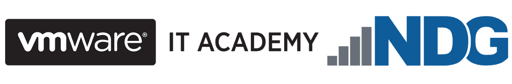

# Network Virtualization Concepts 
### Self-Paced Micro-course

At the end of the course, you should be able to
+	articulate NSX capabilities and benefits
+	describe the major VMware NSX® components in the data, management, and control planes and their interactions
+	apply relevant NSX features to use cases
+	explain NSX network virtualization components and services
+	explain how network virtualization is utilized in an SDDC environment
